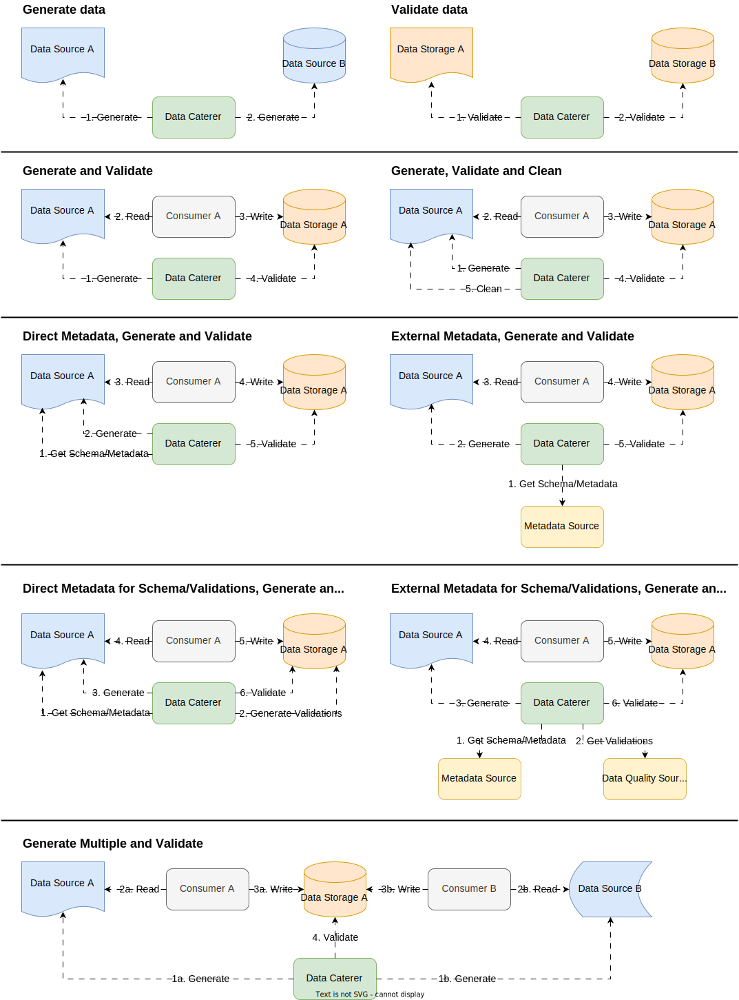

# Data Caterer - Data Generation and Validation Tool


## Overview

Generator data for databases, files, JMS or HTTP request through a Scala/Java API or YAML input and executed via Spark.
Run data validations after generating data to ensure it is consumed correctly.

Full docs can be found [**here**](https://data.catering).

## Features

- Metadata discovery
- Batch and/or event data generation
- Maintain referential integrity across any dataset
- Create custom data generation/validation scenarios
- Clean up generated data
- Data validation
- Suggest data validations


## Quick start

```shell
git clone git@github.com:data-catering/data-caterer-example.git
cd data-caterer-example && ./run.sh
#check results under docker/sample/report/index.html folder
```

## Integrations

### Supported data sources

Data Caterer is able to support the following data sources:

| Data Source Type | Data Source                            | Sponsor |
|------------------|----------------------------------------|---------|
| Database         | Postgres, MySQL, Cassandra             | N       |
| File             | CSV, JSON, ORC, Parquet                | N       |
| Messaging        | Kafka, Solace                          | Y       |
| HTTP             | REST API                               | Y       |
| Metadata         | Marquez, OpenMetadata, OpenAPI/Swagger | Y       |

## Supported use cases

1. Insert into single data sink
2. Insert into multiple data sinks
   1. Foreign keys associated between data sources
   2. Number of records per column value
3. Set random seed at column and whole data generation level
4. Generate real looking data (via DataFaker) and edge cases
   1. Names, addresses, places etc.
   2. Edge cases for each data type (e.g. newline character in string, maximum integer, NaN, 0)
   3. Nullability
5. Send events progressively
6. Automatically insert data into data source
   1. Read metadata from data source and insert for all sub data sources (e.g. tables)
   2. Get statistics from existing data in data source if exists
7. Track and delete generated data
8. Extract data profiling and metadata from given data sources
   1. Calculate the total number of combinations
9. Validate data
   1. Basic column validations (not null, contains, equals, greater than)
   2. Aggregate validations (group by account_id and sum amounts should be less than 100, each account should have at
      least one transaction)
   3. Upstream data source validations (generate data and then check same data is inserted in another data source with
      potential transformations)
   4. Column name validations (check count and ordering of column names)
10. Data migration validations
    1. Ensure row counts are equal
    2. Check both data sources have same values for key columns

## Run Configurations

Different ways to run Data Caterer based on your use case:



## Sponsorship

Data Caterer is set up under a sponsorware model where all features are available to sponsors. The core features
are available here in this project for all to use/fork/update/improve etc., as the open core.

Sponsors have access to the following features:

- Metadata discovery
- All data sources (see [here for all data sources](https://data.catering/setup/connection/))
- Batch and Event generation
- [Auto generation from data connections or metadata sources](https://data.catering/setup/guide/scenario/auto-generate-connection/)
- Suggest data validations
- [Clean up generated data](https://data.catering/setup/guide/scenario/delete-generated-data/)
- Run as many times as you want, not charged by usage
- [Plus more to come](#roadmap)

[Find out more details here to help with sponsorship.](https://data.catering/sponsor)

This is inspired by the [mkdocs-material project](https://github.com/squidfunk/mkdocs-material) which
[follows the same model](https://squidfunk.github.io/mkdocs-material/insiders/).

## Contributing

[View details here about how you can contribute to the project.](CONTRIBUTING.md)

## Additional Details

### Design

[Design motivations and details can be found here.](https://data.catering/setup/design)

### Roadmap

[Can check here for full list.](https://data.catering/use-case/roadmap/)

#### UI

1. Allow the application to run with UI enabled
2. Runs as long-lived app with UI that interacts with existing app as single container
3. Ability to run as UI, Spark job or both
4. Persist data in files or database (Postgres)
5. UI will show history of data generation/validation runs, delete generated data, create new scenarios, define data connections


